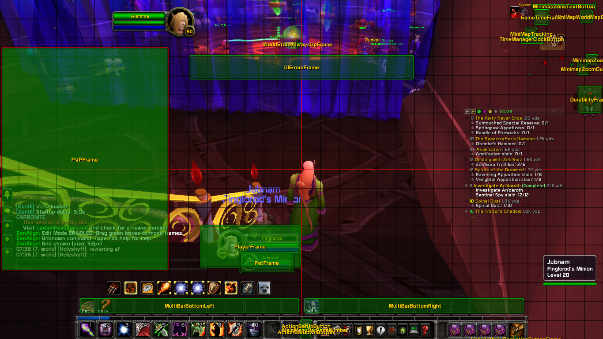

# ZenAlign

**The Ultimate UI Alignment Addon for WoW 3.3.5a (WotLK)**

Combining the best of Align, BlizzMove, and MoveAnything with advanced grid snapping.

## Features

### 🎯 Grid Snapping (Primary USP)
- **Magnetic Snap**: Frames magnetize to grid intersections
- **Multiple Snap Modes**: Corner, edge, center, or all
- **Visual Preview**: Green crosshair shows snap point
- **Configurable Tolerance**: Adjust snap distance

### 📐 Grid Overlay
- Customizable grid size (32-256px)
- Red center lines for easy alignment
- Adjustable colors and opacity
- Toggle on/off with `/za grid`

### 🎨 Frame Management
- Move any frame by dragging
- Scale with Ctrl+MouseWheel
- Adjust transparency
- Hide/show frames
- Save positions per profile

### 💾 Profile System
- Multiple profiles support
- Per-character settings
- Import/export configurations
- Quick profile switching

## Installation

1. Extract to `World of Warcraft/Interface/AddOns/`
2. Ensure folder is named `ZenAlign`
3. Restart WoW or `/reload`

## Quick Start

```
/za grid          - Toggle grid overlay
/za grid 64       - Show grid with 64px size
/za snap on       - Enable grid snapping
/za edit          - Open frame editor (coming soon)
/za reset all     - Reset all frames
/za help          - Show all commands
```

## Commands

| Command | Description |
|---------|-------------|
| `/za grid [size]` | Toggle grid (optional: set size) |
| `/za snap [on\|off]` | Toggle grid snapping |
| `/za edit` | Open frame editor |
| `/za reset <frame>` | Reset frame position |
| `/za reset all` | Reset all frames |
| `/za profile <name>` | Switch profile |
| `/za debug` | Toggle debug mode |

## Development Status

### ✅ Completed
- Core initialization system
- Database and profile management
- Grid overlay (from Align)
- Snap Engine with magnetic snapping
- Comprehensive slash command system
- Utility functions

### 🚧 In Progress
- Frame Manager (drag-to-move)
- Position, Scale, Alpha modules
- Frame database (from MoveAnything)

### 📋 Planned
- Visual frame editor UI
- Virtual movers
- Keybind support
- Import/export
- Preset layouts

## Architecture

```
ZenAlign/
├── Core/           - Core systems (API, Utils, Events)
├── Modules/        - Feature modules (Grid, Snap, Position, etc.)
├── UI/             - User interface
├── Data/           - Frame database and virtual movers
└── Localization/   - Language files
```

## Credits

**ZenAlign** combines ideas and code from:
- **Align** by Akeru - Grid overlay system
- **BlizzMove** by yess - Simple drag-to-move mechanics
- **MoveAnything** by Wagthaa - Comprehensive frame coverage

## License

This addon is a synthesis of three open-source addons. Please respect the original authors' work.

## Support

For issues, suggestions, or contributions, please... [add your contact info here]

---

**Version**: 1.0.0 (Alpha)
**WoW Version**: 3.3.5a (WotLK)
**Status**: In Development
